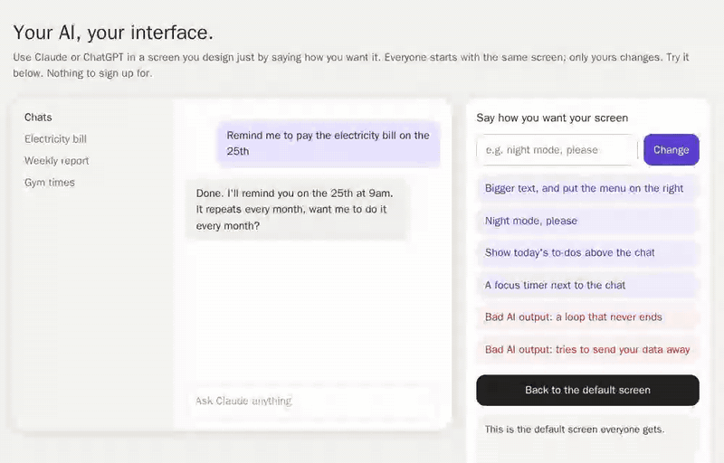
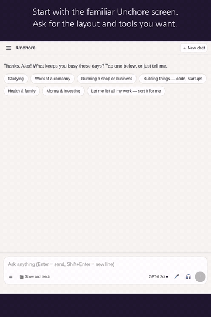

# Redesign your app by talking to it

**Everyone starts with the same screen. Each user says how they want theirs, and only theirs changes.**
This repo is the pattern behind "your screen, your way" in [Unchore](https://unchore.ai/?utm_source=github&utm_medium=malleable-ui-readme), boiled down to one dependency-free file you can read in five minutes.

**[▶ Try the live demo](https://smilemino.github.io/unchore-malleable-ui/)** (no signup, no AI key)



## Why

Apps ship one layout for millions of people. A designer picks where the menu goes, and everyone lives with it.
Now that an AI can write a screen from a sentence, that choice can belong to each user:

- "Bigger text, and put the menu on the right."
- "Show today's to-dos above the chat."
- "A focus timer next to the chat."

The hard part is not getting an AI to write the screen. It is letting AI-written code run inside a logged-in app without it reading other people's data, phoning home, or locking the user out.
Ink & Switch calls this direction [malleable software](https://www.inkandswitch.com/essay/malleable-software/). This repo is one small, practical piece of it.

## How it stays safe

[`sandbox.js`](sandbox.js) (about 130 lines) does four things:

| | What happens | What it stops |
|---|---|---|
| 1 | The screen is drawn inside an iframe with `sandbox="allow-scripts"` and **no** `allow-same-origin` | Reading your app's cookies, storage or page |
| 2 | The screen's logic runs in a Web Worker started inside that iframe, under `connect-src 'none'` | `fetch`, `WebSocket`, `importScripts` to anywhere |
| 3 | A small trusted renderer keeps an allow-list of tags and attributes | `<script>`, ``, `<a>`, `<form>`, every `on*` handler |
| 4 | A new screen is test-run hidden for 1.5 s, and a watchdog pings it every 250 ms | Broken or frozen screens replacing a working one |

The "back to default" button lives outside the sandbox, so a bad screen can never hide the way out.

The AI-written code only gets four calls:

```js
ui.render(html, css)      // draw (sanitized)
ui.onAction(fn)           // clicks and changes on [data-action] elements
ui.load(key)              // this user's own saved data
ui.save(key, value)
```

```js
import { mountScreen } from './sandbox.js';

const result = await mountScreen(container, aiWrittenCode, {
  store: { load: k => db.get(userId, k), save: (k, v) => db.set(userId, k, v) },
  onFail: () => showDefaultScreen(),
});
if (!result.ok) keepCurrentScreen(result.reason); // 'froze' | 'crashed' | 'never drew'
```

## What the demo checks

[`test/demo_test.py`](test/demo_test.py) drives the demo in headless Chromium. 13 of 13 checks pass:

- a typed request moves the menu to the right and makes the text bigger
- a to-do added inside the user's screen survives a reload
- an endless loop is rejected in its test run, the old screen stays, the page stays responsive
- `fetch`, `WebSocket`, `importScripts`, cookies and `localStorage` are all blocked, and no request reaches the outside site
- an injected `<script>` and `onclick` never run
- reset brings back the default screen, and a second visitor still sees the default

```bash
pip install playwright && playwright install chromium
python test/demo_test.py
```

## In Unchore

In the demo the edits are pre-written so it runs without an AI. In Unchore you just say it in the chat. The AI writes the screen, it is test-run, saved to your account only, and you can go back to the default screen at any time.



Unchore is a personal AI: ask anything, and if it repeats, Unchore offers to automate it. *Humans do the creative work. AI does the chores.*
→ [unchore.ai](https://unchore.ai/?utm_source=github&utm_medium=malleable-ui-readme)

## Limits

- Only tested in Chromium so far. Firefox and Safari are not tested yet.
- This is a pattern, not a security audit. CSS can still make a screen ugly or hard to read; that is why the way back sits outside the sandbox.
- The demo stores each visitor's screen in `localStorage`. A real app should store it per user on the server.

## 한국어 요약

처음에는 모두 같은 화면으로 시작하고, 회원이 «글자 크게, 메뉴는 오른쪽에»처럼 말하면 그 사람 화면만 바뀝니다. AI가 만든 화면 코드는 인터넷에 접속할 수 없고 쿠키나 저장 공간도 읽지 못하는 격리된 공간에서만 실행됩니다. 먼저 보이지 않게 시험해 보고 통과한 화면만 적용되며, 기본 화면으로 돌아가는 단추는 늘 격리된 공간 밖에 있습니다. [언초어](https://unchore.ai/?utm_source=github&utm_medium=malleable-ui-readme-ko)에서 실제로 쓸 수 있습니다.

MIT License
